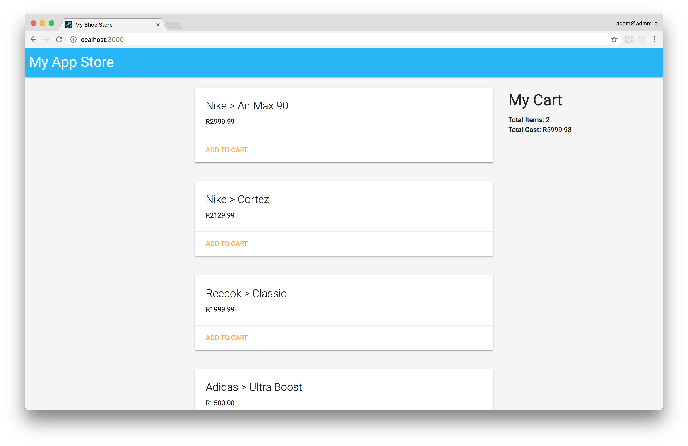

# React Interview Exercise

In this exercise, we will build a Shoe Store. 

Building an entire shoe store from scratch might seem daunting. 
To help you along, we've already created the shells for all the
components you'll need. We've also created tests to guide you along.

## Getting started

### Prequisites

Before you can install and run this application, you'll need the following installed:

- Node v7.x
- Git

### Install

If you have the above installed, you can proceed to [fork](https://help.github.com/articles/fork-a-repo/) 
this repository. In the root directory of this repo, you can install the project dependencies by running:

    npm install
    
### Run

Once you have installed the dependencies, you can run the application using:
    
    npm start
   
This should run the application and open `http://localhost:3000`. You should now see the text `Hello World`
on the page.

## How does it work?

This exercise will be completed in a 'Koans' style. Essentially, you clone this repo and run the test suite.
In the beginning you will have a few dozen tests that fail. The goal here is to work your way through the test
cases, writing components and functions, getting each test case to pass one by one.
Hopefully by the end you should have a working application!

The test cases are split into several levels, with each level requiring a more complex understanding
of React (and coding in general). Not all levels are required, please refer to the email you were sent
by recruitment to confirm what levels are required (and which are just nice to have).

To run the tests interactively while you code, just run:

    npm test
    
The above command will run the tests for all levels, it is recommended that you run tests
just for the level you are on. To do this:

    npm test level1
    
If you prefer a more complete view of all test cases, you can run:

    npm test -- --verbose

### Level goals

To become a ninja, you need to level up. Here's what each level is about:

#### Level 1

- Creating the homepage that contains a NavBar and ShoeList
- Requesting the list of shoes from the mock API
- Rendering a Shoe for every item in the ShoeList

#### Level 2

- Adding a button to each shoe that allows us to add it to our cart
- Creating a CartSummary component that shows the number of items in our cart and the total cost.

#### Level 3

In this level, most of the tests have been written for you. However, there are some tests
that still need to be completed by you!

- Creating a facet and filter pane that allows the users to filter by brand (think online shopping)

#### Level 4

Level 4 differs from the previous levels as **test cases are not provided**. To complete this level
you need to create new components and write the relevant tests for the following story:

* As a customer, I would like to be able to view the items in my cart
* As a customer, I would like to be able to remove items from my cart

#### Level 5

In level 5, there are no specific stories. Instead, Level 5 is focused more on
exploring more advanced topics in React. Here are some ideas of things to implement:

- Use Local Storage to keep track of what customers have added to their cart
- Introduce Redux in an idiomatic and relevant way
- Allow the customer to 'Checkout'. This should take him to a new page where he
can enter his delivery details (try React Router)
- Create an actual API

## Submission (important!)

When you're done, we would like to receive an email containing the following:

- A link to your code on Github. The link should point to the fork of the repo
you created earlier. It should contain all the code that you've done to make the tests
pass.
- A link to a running version of the app. We recommend you deploy the app using Github pages
as it's the quickest and easiest way. For more information on how to deploy this app, checkout
this [Deployment Guide](https://github.com/facebookincubator/create-react-app/blob/master/packages/react-scripts/template/README.md#deployment)

## Best Practices

Here are a few tips that might help out:

- Work on getting one test to pass at a time. If you don't like seeing all the red, you 
can even configure Jest to run one test at a time.
- Make a Git commit every time you get a test to pass. We love atomic commits.
- Run the test suite continuously while you code (this is even more important than running the app!)

## Resources

* [Official Tutorial](https://facebook.github.io/react/tutorial/tutorial.html)
* [Egghead.io](https://egghead.io/courses)
* [Scotch.io](https://scotch.io/tutorials/learning-react-getting-started-and-concepts)
* [This book](https://www.fullstackreact.com/)

This project was bootstrapped with [Create React App](https://github.com/facebookincubator/create-react-app).
The README is also a great place to find some tips!
